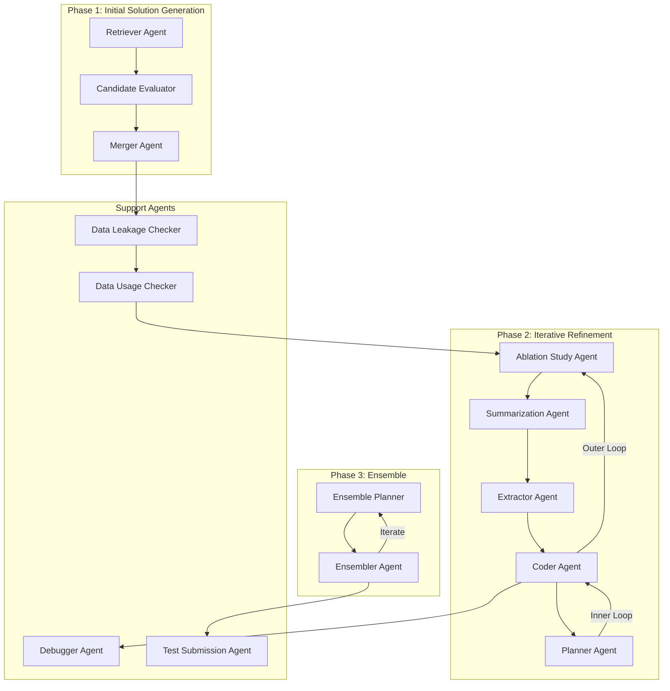

# Design Document

## Overview

This document describes the design for implementing MLE-STAR (Machine Learning Engineering Agent via Search and Targeted Refinement) using the Strands Agents SDK. The system is a multi-agent framework that automates machine learning engineering tasks by:

1. Using web search to retrieve state-of-the-art models for a given task
2. Evaluating and merging candidate models into an initial solution
3. Iteratively refining solutions through ablation studies and targeted code block improvements
4. Combining multiple solutions using intelligent ensemble strategies

The implementation leverages Strands' Graph multi-agent pattern for orchestrating the complex workflow with conditional edges, cyclic refinement loops, and shared state management.

## Architecture

The MLE-STAR system follows a hierarchical multi-agent architecture with three main phases:



### High-Level Flow

1. **Input Processing**: Parse task description and validate dataset
2. **Model Retrieval**: Search web for effective models (4 candidates by default)
3. **Candidate Evaluation**: Generate and evaluate code for each model
4. **Model Merging**: Combine best candidates into initial solution
5. **Safety Checks**: Run data leakage and data usage checkers
6. **Outer Loop** (4 iterations): Select code blocks via ablation study
7. **Inner Loop** (4 iterations per outer): Refine selected code block with different plans
8. **Ensemble**: Combine parallel solutions using LLM-proposed strategies
9. **Submission**: Generate final submission file

## Components and Interfaces

### Core Configuration

```python
from dataclasses import dataclass
from typing import Optional

@dataclass
class MLEStarConfig:
    """Configuration for MLE-STAR agent."""
    num_retrieved_models: int = 4
    inner_loop_iterations: int = 4
    outer_loop_iterations: int = 4
    ensemble_iterations: int = 5
    max_debug_retries: int = 3
    model_id: str = "anthropic.claude-sonnet-4-20250514-v1:0"
    temperature: float = 0.7
    max_tokens: int = 4096
```

### Agent Definitions

Each agent is implemented as a Strands Agent with specific tools and system prompts:

#### 1. Retriever Agent (Aretriever)

```python
from strands import Agent, tool
from strands_tools import http_request

@tool
def web_search(query: str, num_results: int = 4) -> list[dict]:
    """Search the web for ML models and approaches.
    
    Args:
        query: Search query for finding ML models
        num_results: Number of results to return
    """
    # Implementation using search API
    pass

retriever_agent = Agent(
    name="retriever",
    system_prompt="""You are a Kaggle grandmaster. Given a task description,
    search for state-of-the-art models that could be effective for this task.
    Return model descriptions and example code for each candidate.""",
    tools=[web_search],
    model=model
)
```

#### 2. Candidate Evaluation Agent (Ainit)

```python
@tool
def execute_python(code: str, timeout: int = 300) -> dict:
    """Execute Python code and return results.
    
    Args:
        code: Python code to execute
        timeout: Maximum execution time in seconds
    """
    pass

candidate_eval_agent = Agent(
    name="candidate_evaluator",
    system_prompt="""You are a Kaggle grandmaster. Generate Python code to 
    evaluate a model on the given task. The code should:
    - Split data into train/validation sets
    - Train the model
    - Print 'Final Validation Performance: {score}'""",
    tools=[execute_python],
    model=model
)
```

#### 3. Merger Agent (Amerger)

```python
merger_agent = Agent(
    name="merger",
    system_prompt="""You are a Kaggle grandmaster. Integrate the reference 
    solution into the base solution by:
    - Training additional models from the reference
    - Creating a simple average ensemble
    - Keeping similar functionality together""",
    tools=[execute_python],
    model=model
)
```

#### 4. Ablation Study Agent (Aabl)

```python
ablation_agent = Agent(
    name="ablation_study",
    system_prompt="""You are a Kaggle grandmaster. Generate Python code that 
    performs an ablation study on the solution by:
    - Identifying distinct ML components (preprocessing, feature engineering, etc.)
    - Creating variations that modify or disable each component
    - Measuring performance impact of each variation
    Consider previous ablation summaries to explore different parts.""",
    tools=[execute_python],
    model=model
)
```

#### 5. Summarization Agent (Asummarize)

```python
summarization_agent = Agent(
    name="summarizer",
    system_prompt="""You are an expert at analyzing ML experiments. 
    Parse the ablation study output and summarize:
    - Baseline performance
    - Impact of each component modification
    - Which component has the most significant effect""",
    tools=[],
    model=model
)
```

#### 6. Extractor Agent (Aextractor)

```python
extractor_agent = Agent(
    name="extractor",
    system_prompt="""You are a Kaggle grandmaster. Based on the ablation summary:
    - Identify the code block with the most significant performance impact
    - Prioritize blocks not previously refined
    - Generate an initial refinement plan for the extracted block""",
    tools=[],
    model=model
)
```

#### 7. Coder Agent (Acoder)

```python
coder_agent = Agent(
    name="coder",
    system_prompt="""You are a Kaggle grandmaster. Implement the refinement 
    plan on the extracted code block. Return only the refined code block.""",
    tools=[],
    model=model
)
```

#### 8. Planner Agent (Aplanner)

```python
planner_agent = Agent(
    name="planner",
    system_prompt="""You are a Kaggle grandmaster. Based on previous refinement 
    attempts and their performance, propose a new refinement plan that:
    - Explores different strategies than previous attempts
    - Targets the same code block
    - Could potentially improve performance""",
    tools=[],
    model=model
)
```

#### 9. Ensemble Planner Agent (Aens_planner)

```python
ensemble_planner_agent = Agent(
    name="ensemble_planner",
    system_prompt="""You are a Kaggle grandmaster. Propose an ensemble strategy 
    to combine multiple solutions. Consider:
    - Simple averaging of predictions
    - Weighted averaging with optimized weights
    - Stacking with a meta-learner
    Use previous ensemble attempts as feedback.""",
    tools=[],
    model=model
)
```

#### 10. Ensembler Agent (Aensembler)

```python
ensembler_agent = Agent(
    name="ensembler",
    system_prompt="""You are a Kaggle grandmaster. Implement the ensemble plan 
    to combine the provided solutions into a single merged solution.""",
    tools=[execute_python],
    model=model
)
```

#### 11. Debugger Agent (Adebugger)

```python
debugger_agent = Agent(
    name="debugger",
    system_prompt="""You are an expert Python debugger. Analyze the error 
    traceback and fix the code. Return the corrected code.""",
    tools=[],
    model=model
)
```

#### 12. Data Leakage Checker (Aleakage)

```python
leakage_checker_agent = Agent(
    name="leakage_checker",
    system_prompt="""You are a data science expert. Analyze the preprocessing 
    code for data leakage risks:
    - Check if test/validation statistics are used during training
    - Verify proper train/test separation
    - Return corrected code if leakage is detected""",
    tools=[],
    model=model
)
```

#### 13. Data Usage Checker (Adata)

```python
data_usage_checker_agent = Agent(
    name="data_usage_checker",
    system_prompt="""You are a data science expert. Verify that all provided 
    data files are utilized in the solution. If any data sources are unused,
    revise the solution to incorporate them.""",
    tools=[],
    model=model
)
```

#### 14. Test Submission Agent (Atest)

```python
submission_agent = Agent(
    name="submission_generator",
    system_prompt="""You are a Kaggle grandmaster. Modify the solution to:
    - Load test data
    - Remove any subsampling
    - Use full training set
    - Generate submission.csv in the required format""",
    tools=[execute_python],
    model=model
)
```

### Graph Orchestration

The main workflow is orchestrated using Strands' Graph pattern:

```python
from strands.multiagent import GraphBuilder
from strands.multiagent.base import MultiAgentBase, Status

class MLEStarOrchestrator:
    def __init__(self, config: MLEStarConfig):
        self.config = config
        self.state = MLEStarState()
        
    def build_initial_solution_graph(self) -> Graph:
        """Build graph for Phase 1: Initial Solution Generation."""
        builder = GraphBuilder()
        
        builder.add_node(retriever_agent, "retriever")
        builder.add_node(CandidateEvaluationNode(), "evaluator")
        builder.add_node(MergerNode(), "merger")
        builder.add_node(leakage_checker_agent, "leakage_check")
        builder.add_node(data_usage_checker_agent, "usage_check")
        
        builder.add_edge("retriever", "evaluator")
        builder.add_edge("evaluator", "merger")
        builder.add_edge("merger", "leakage_check")
        builder.add_edge("leakage_check", "usage_check")
        
        builder.set_entry_point("retriever")
        return builder.build()
    
    def build_refinement_graph(self) -> Graph:
        """Build graph for Phase 2: Iterative Refinement with cycles."""
        builder = GraphBuilder()
        
        builder.add_node(ablation_agent, "ablation")
        builder.add_node(summarization_agent, "summarize")
        builder.add_node(extractor_agent, "extract")
        builder.add_node(RefinementLoopNode(), "refine")
        
        builder.add_edge("ablation", "summarize")
        builder.add_edge("summarize", "extract")
        builder.add_edge("extract", "refine")
        builder.add_edge("refine", "ablation", condition=self.should_continue_outer_loop)
        
        builder.set_max_node_executions(50)
        builder.set_entry_point("ablation")
        return builder.build()
```

### Custom Nodes for Complex Logic

```python
class RefinementLoopNode(MultiAgentBase):
    """Custom node implementing the inner refinement loop."""
    
    def __init__(self, config: MLEStarConfig):
        super().__init__()
        self.config = config
        self.coder = coder_agent
        self.planner = planner_agent
        self.debugger = debugger_agent
        
    async def invoke_async(self, task, invocation_state, **kwargs):
        code_block = invocation_state.get("current_code_block")
        current_solution = invocation_state.get("current_solution")
        initial_plan = invocation_state.get("initial_plan")
        
        best_score = invocation_state.get("best_score", float("-inf"))
        best_solution = current_solution
        attempts = []
        
        # Inner loop iterations
        for i in range(self.config.inner_loop_iterations):
            if i == 0:
                plan = initial_plan
            else:
                # Get new plan from planner
                plan_result = await self.planner.invoke_async(
                    f"Code block: {code_block}\nPrevious attempts: {attempts}"
                )
                plan = str(plan_result)
            
            # Implement the plan
            refined_block = await self.coder.invoke_async(
                f"Code block: {code_block}\nPlan: {plan}"
            )
            
            # Substitute into solution
            candidate = current_solution.replace(code_block, str(refined_block))
            
            # Execute and evaluate
            score = await self._evaluate_solution(candidate)
            
            attempts.append({"plan": plan, "score": score})
            
            if score > best_score:
                best_score = score
                best_solution = candidate
        
        # Update state
        invocation_state["best_score"] = best_score
        invocation_state["current_solution"] = best_solution
        
        return self._create_result(best_solution, best_score)
```

## Data Models

### Task Description

```python
@dataclass
class TaskDescription:
    """Represents an ML task to solve."""
    description: str
    task_type: str  # classification, regression, seq2seq, etc.
    data_modality: str  # tabular, image, text, audio
    evaluation_metric: str
    dataset_path: str
    submission_format: Optional[str] = None
```

### Model Candidate

```python
@dataclass
class ModelCandidate:
    """A retrieved model candidate."""
    name: str
    description: str
    example_code: str
    validation_score: Optional[float] = None
    generated_code: Optional[str] = None
```

### Solution State

```python
@dataclass
class SolutionState:
    """Tracks the current state of solution development."""
    current_code: str
    validation_score: float
    ablation_summaries: list[str]
    refined_blocks: list[str]
    outer_iteration: int = 0
    inner_iteration: int = 0
```

### Refinement Attempt

```python
@dataclass
class RefinementAttempt:
    """Records a single refinement attempt."""
    plan: str
    refined_code_block: str
    full_solution: str
    validation_score: float
    iteration: int
```

### Ensemble Result

```python
@dataclass
class EnsembleResult:
    """Result of an ensemble strategy."""
    strategy: str
    merged_code: str
    validation_score: float
    iteration: int
```

## Correctness Properties

*A property is a characteristic or behavior that should hold true across all valid executions of a system-essentially, a formal statement about what the system should do. Properties serve as the bridge between human-readable specifications and machine-verifiable correctness guarantees.*

### Property 1: Task parsing extracts required fields
*For any* valid task description string containing task type, data modality, and evaluation metric information, parsing it SHALL produce a TaskDescription object with non-empty task_type, data_modality, and evaluation_metric fields.
**Validates: Requirements 1.2**

### Property 2: Model retrieval returns structured candidates
*For any* task description and configured num_retrieved_models N, the retriever agent SHALL return at most N model candidates, each containing non-empty name, description, and example_code fields.
**Validates: Requirements 2.3, 2.4**

### Property 3: Candidate evaluation produces scores or errors
*For any* model candidate, the candidate evaluation agent SHALL produce either a valid numeric validation score or an error status indicating failure.
**Validates: Requirements 3.3, 3.4**

### Property 4: Merging maintains sorted order and stops on degradation
*For any* list of evaluated candidates, the merger SHALL process them in descending score order and stop merging when a merged solution performs worse than the current best.
**Validates: Requirements 4.1, 4.2, 4.4**

### Property 5: Ablation study captures component impacts
*For any* solution with identifiable ML components, the ablation study SHALL produce performance measurements for each component variation tested.
**Validates: Requirements 5.2, 5.3**

### Property 6: Extractor prioritizes unrefined blocks
*For any* extraction operation with a non-empty set of previously refined blocks, the extractor SHALL select a block not in that set when such blocks exist.
**Validates: Requirements 6.3**

### Property 7: Inner loop selects best performer
*For any* refinement inner loop with multiple attempts, the selected candidate SHALL have a validation score greater than or equal to all other attempts in that loop.
**Validates: Requirements 7.4, 7.5**

### Property 8: Outer loop maintains growing history
*For any* sequence of outer loop iterations, the length of ablation_summaries and refined_blocks lists SHALL equal the number of completed iterations.
**Validates: Requirements 8.2, 8.4**

### Property 9: Ensemble selects best strategy
*For any* ensemble exploration with multiple strategies attempted, the final result SHALL be the strategy with the highest validation score among all attempted strategies.
**Validates: Requirements 9.4**

### Property 10: Debugger respects retry limit
*For any* debugging session with errors, the debugger SHALL attempt at most max_debug_retries corrections before returning the last working version or failing gracefully.
**Validates: Requirements 10.2, 10.3**

### Property 11: Leakage checker produces valid corrections
*For any* solution with detected data leakage in preprocessing, the corrected code SHALL not reference test or validation data statistics during training data preparation.
**Validates: Requirements 11.2, 11.3**

### Property 12: Data usage checker incorporates missing files
*For any* solution that does not reference all provided data files, the revised solution SHALL contain references to all files listed in the task description.
**Validates: Requirements 12.2, 12.3**

### Property 13: Submission removes subsampling
*For any* solution containing subsampling logic, the generated submission code SHALL not contain that subsampling logic.
**Validates: Requirements 13.2, 13.4**

### Property 14: Configuration round-trip consistency
*For any* MLEStarConfig object with valid parameter values, serializing to dictionary/JSON and deserializing SHALL produce an equivalent configuration object.
**Validates: Requirements 15.1-15.5**

## Error Handling

### Code Execution Errors

When Python code execution fails:
1. Capture the full traceback
2. Pass to Debugger Agent with original code
3. Retry execution with corrected code
4. After max retries, use last working version and log warning

### Agent Invocation Errors

When an agent fails to produce valid output:
1. Retry with clarified prompt (up to 2 retries)
2. If still failing, use fallback strategy (e.g., skip refinement iteration)
3. Log error for debugging

### Timeout Handling

- Individual code execution: 5 minute timeout
- Agent invocation: 2 minute timeout
- Full pipeline: 24 hour timeout (configurable)

### State Recovery

The system maintains checkpoints after each major phase:
- After initial solution generation
- After each outer loop iteration
- After ensemble completion

This enables resuming from failures without losing progress.

## Testing Strategy

### Unit Testing

Unit tests verify individual components:
- Task description parsing
- Configuration validation
- Code block extraction utilities
- Score parsing from execution output

### Property-Based Testing

Using `hypothesis` library for Python:

```python
from hypothesis import given, strategies as st

@given(st.text(min_size=10))
def test_task_parsing_extracts_fields(description):
    """Property 1: Task parsing extracts required fields."""
    # Feature: mle-star-agent, Property 1: Task parsing extracts required fields
    result = parse_task_description(description)
    assert result.task_type is not None
    assert result.data_modality is not None
```

Each correctness property will be implemented as a property-based test with:
- Minimum 100 iterations per test
- Custom generators for domain-specific types
- Clear reference to the property being validated

### Integration Testing

Integration tests verify agent interactions:
- Retriever → Evaluator flow
- Refinement loop execution
- Ensemble strategy application

### End-to-End Testing

E2E tests run the full pipeline on sample tasks:
- Simple tabular classification
- Image classification
- Text classification

These validate the complete workflow produces valid submissions.
