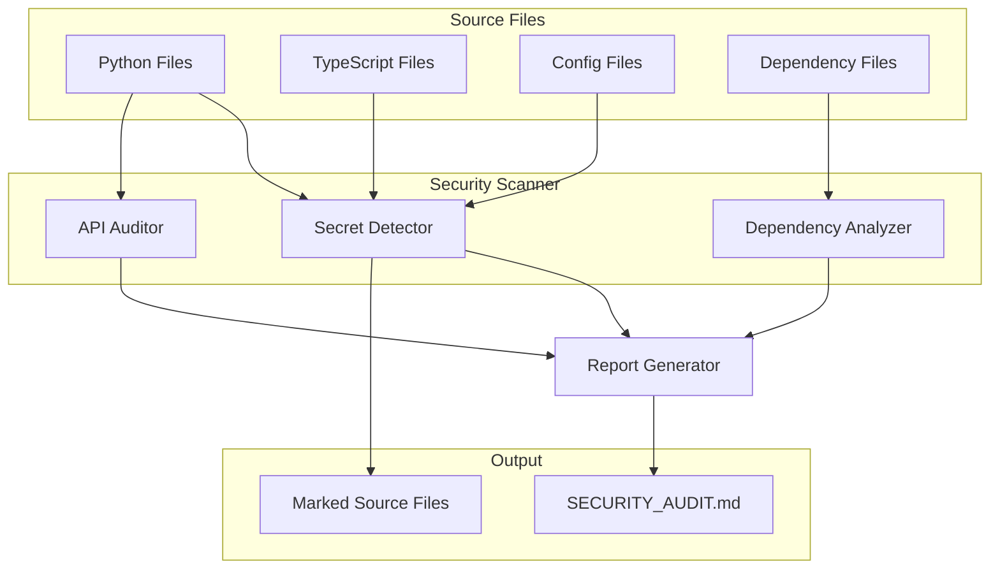

# Design Document: Security Audit & Hardening

## Overview

This design document outlines the architecture and implementation approach for a comprehensive security audit and hardening system for the MLE-STAR codebase. The system consists of four main components: Secret Detector, Dependency Analyzer, API Auditor, and Report Generator. These components work together to identify security vulnerabilities, mark critical issues in source code, and produce a detailed audit report.

The implementation uses Python with regex-based static analysis for secret detection, pip-audit for dependency vulnerability scanning, and AST-based analysis for API endpoint security evaluation. The system is designed to be non-destructive, preserving business logic and existing tests while adding security annotations.

## Architecture



## Components and Interfaces

### 1. Secret Detector

The Secret Detector scans source files for hardcoded secrets using regex patterns.

```python
from dataclasses import dataclass
from enum import Enum
from typing import List, Optional
from pathlib import Path

class SecretCategory(Enum):
    API_KEY = "api_key"
    PASSWORD = "password"
    TOKEN = "token"
    PRIVATE_KEY = "private_key"
    CONNECTION_STRING = "connection_string"
    AWS_CREDENTIALS = "aws_credentials"
    GENERIC_SECRET = "generic_secret"

@dataclass
class SecretFinding:
    file_path: str
    line_number: int
    category: SecretCategory
    pattern_name: str
    redacted_value: str  # First 4 + "..." + last 4 chars
    context_line: str    # The line with secret redacted
    severity: str        # "critical", "high", "medium"

class SecretDetector:
    """Detects hardcoded secrets in source files."""
    
    # Regex patterns for secret detection
    PATTERNS: dict[str, tuple[str, SecretCategory, str]] = {
        "aws_access_key": (
            r'(?:AKIA|ABIA|ACCA|ASIA)[0-9A-Z]{16}',
            SecretCategory.AWS_CREDENTIALS,
            "critical"
        ),
        "aws_secret_key": (
            r'(?i)aws[_\-]?secret[_\-]?(?:access[_\-]?)?key["\']?\s*[:=]\s*["\']?([A-Za-z0-9/+=]{40})',
            SecretCategory.AWS_CREDENTIALS,
            "critical"
        ),
        "generic_api_key": (
            r'(?i)(?:api[_\-]?key|apikey)["\']?\s*[:=]\s*["\']?([A-Za-z0-9_\-]{20,})',
            SecretCategory.API_KEY,
            "high"
        ),
        "password_assignment": (
            r'(?i)(?:password|passwd|pwd)["\']?\s*[:=]\s*["\']([^"\']{8,})["\']',
            SecretCategory.PASSWORD,
            "critical"
        ),
        "bearer_token": (
            r'(?i)bearer\s+([A-Za-z0-9_\-\.]+)',
            SecretCategory.TOKEN,
            "high"
        ),
        "jwt_token": (
            r'eyJ[A-Za-z0-9_-]*\.eyJ[A-Za-z0-9_-]*\.[A-Za-z0-9_-]*',
            SecretCategory.TOKEN,
            "high"
        ),
        "private_key": (
            r'-----BEGIN (?:RSA |EC |DSA |OPENSSH )?PRIVATE KEY-----',
            SecretCategory.PRIVATE_KEY,
            "critical"
        ),
        "connection_string": (
            r'(?i)(?:mongodb|postgres|mysql|redis)://[^\s"\']+',
            SecretCategory.CONNECTION_STRING,
            "high"
        ),
        "openai_key": (
            r'sk-[A-Za-z0-9]{48}',
            SecretCategory.API_KEY,
            "critical"
        ),
        "github_token": (
            r'(?:ghp|gho|ghu|ghs|ghr)_[A-Za-z0-9]{36}',
            SecretCategory.TOKEN,
            "critical"
        ),
    }
    
    FILE_EXTENSIONS = {".py", ".ts", ".tsx", ".js", ".jsx", ".json", ".yaml", ".yml", ".env"}
    
    def scan_file(self, file_path: Path) -> List[SecretFinding]: ...
    def scan_directory(self, directory: Path, exclude_dirs: set[str]) -> List[SecretFinding]: ...
    def redact_value(self, value: str) -> str: ...
```

### 2. Dependency Analyzer

The Dependency Analyzer checks project dependencies against CVE databases.

```python
@dataclass
class VulnerableDependency:
    package_name: str
    current_version: str
    cve_id: str
    severity: str  # "critical", "high", "medium", "low"
    description: str
    fixed_version: Optional[str]
    source_file: str  # "requirements.txt" or "package.json"

class DependencyAnalyzer:
    """Analyzes dependencies for known vulnerabilities."""
    
    def parse_requirements_txt(self, file_path: Path) -> dict[str, str]: ...
    def parse_package_json(self, file_path: Path) -> dict[str, str]: ...
    def check_python_vulnerabilities(self, dependencies: dict[str, str]) -> List[VulnerableDependency]: ...
    def check_npm_vulnerabilities(self, dependencies: dict[str, str]) -> List[VulnerableDependency]: ...
    def analyze(self, project_root: Path) -> List[VulnerableDependency]: ...
```

### 3. API Auditor

The API Auditor analyzes API endpoints for OWASP Top 10 vulnerabilities.

```python
class OWASPCategory(Enum):
    A01_BROKEN_ACCESS_CONTROL = "A01:2021-Broken Access Control"
    A02_CRYPTOGRAPHIC_FAILURES = "A02:2021-Cryptographic Failures"
    A03_INJECTION = "A03:2021-Injection"
    A04_INSECURE_DESIGN = "A04:2021-Insecure Design"
    A05_SECURITY_MISCONFIGURATION = "A05:2021-Security Misconfiguration"
    A07_AUTH_FAILURES = "A07:2021-Identification and Authentication Failures"

@dataclass
class EndpointFinding:
    file_path: str
    line_number: int
    endpoint_path: str
    http_method: str
    vulnerability: str
    owasp_category: OWASPCategory
    severity: str
    description: str
    recommendation: str

class APIAuditor:
    """Audits API endpoints for security vulnerabilities."""
    
    # Patterns for detecting FastAPI/Flask endpoints
    ROUTE_PATTERNS = {
        "fastapi_decorator": r'@app\.(get|post|put|delete|patch)\s*\(\s*["\']([^"\']+)["\']',
        "fastapi_router": r'@router\.(get|post|put|delete|patch)\s*\(\s*["\']([^"\']+)["\']',
    }
    
    # Auth-related patterns
    AUTH_PATTERNS = [
        r'Depends\s*\(\s*(?:get_current_user|verify_token|auth|authenticate)',
        r'@requires_auth',
        r'@login_required',
        r'Authorization',
    ]
    
    # Input validation patterns
    VALIDATION_PATTERNS = [
        r'Annotated\[.*,\s*(?:Query|Path|Body)\s*\(',
        r'pydantic',
        r'validator',
        r'Field\s*\(',
    ]
    
    def scan_file(self, file_path: Path) -> List[EndpointFinding]: ...
    def check_auth(self, file_content: str, endpoint_line: int) -> bool: ...
    def check_input_validation(self, file_content: str, endpoint_line: int) -> bool: ...
    def analyze_directory(self, api_dir: Path) -> List[EndpointFinding]: ...
```

### 4. Report Generator

The Report Generator produces the SECURITY_AUDIT.md document.

```python
@dataclass
class AuditReport:
    timestamp: str
    executive_summary: str
    total_findings: int
    critical_count: int
    high_count: int
    medium_count: int
    low_count: int
    secret_findings: List[SecretFinding]
    dependency_findings: List[VulnerableDependency]
    api_findings: List[EndpointFinding]
    remediation_plan: List[str]

class ReportGenerator:
    """Generates the SECURITY_AUDIT.md report."""
    
    def generate_executive_summary(self, findings: AuditReport) -> str: ...
    def generate_findings_table(self, findings: AuditReport) -> str: ...
    def generate_remediation_plan(self, findings: AuditReport) -> str: ...
    def generate_report(self, findings: AuditReport, output_path: Path) -> None: ...
```

### 5. Source Marker

The Source Marker adds security comments to source files.

```python
class SourceMarker:
    """Marks critical vulnerabilities in source files."""
    
    PYTHON_COMMENT = "# TODO: SECURITY CRITICAL - {description}"
    JS_TS_COMMENT = "// TODO: SECURITY CRITICAL - {description}"
    
    def mark_file(self, file_path: Path, findings: List[SecretFinding]) -> List[str]: ...
    def get_comment_format(self, file_path: Path) -> str: ...
    def insert_comment(self, lines: List[str], line_number: int, comment: str) -> List[str]: ...
```

## Data Models

```python
from dataclasses import dataclass, field
from datetime import datetime
from typing import List, Optional
from enum import Enum

@dataclass
class ScanConfig:
    """Configuration for the security scanner."""
    project_root: Path
    exclude_dirs: set[str] = field(default_factory=lambda: {
        ".git", ".venv", "node_modules", "__pycache__", ".next", ".hypothesis"
    })
    exclude_files: set[str] = field(default_factory=lambda: {"*.pyc", "*.lock"})
    scan_secrets: bool = True
    scan_dependencies: bool = True
    scan_api: bool = True
    mark_critical: bool = True
    api_directories: List[str] = field(default_factory=lambda: ["src/mle_star/api", "routes"])

@dataclass
class ScanResult:
    """Complete scan result."""
    config: ScanConfig
    secret_findings: List[SecretFinding]
    dependency_findings: List[VulnerableDependency]
    api_findings: List[EndpointFinding]
    marked_files: List[str]
    scan_duration_seconds: float
    scanned_files_count: int
    timestamp: datetime
```


## Correctness Properties

*A property is a characteristic or behavior that should hold true across all valid executions of a system—essentially, a formal statement about what the system should do. Properties serve as the bridge between human-readable specifications and machine-verifiable correctness guarantees.*

### Property 1: File Extension Coverage

*For any* directory containing files with extensions in {.py, .ts, .tsx, .js, .jsx, .json, .yaml, .yml, .env}, the Secret_Detector SHALL scan all such files and return findings only from files with those extensions.

**Validates: Requirements 1.1**

### Property 2: Secret Pattern Detection

*For any* string that matches a defined secret pattern (API key, password, token, private key, connection string), the Secret_Detector SHALL identify it as a potential secret with the correct category classification.

**Validates: Requirements 1.2**

### Property 3: Secret Redaction Correctness

*For any* detected secret value of length >= 8, the redacted output SHALL contain exactly the first 4 characters, followed by "...", followed by the last 4 characters, and the full secret value SHALL NOT appear in any output.

**Validates: Requirements 1.3, 1.4**

### Property 4: Category Summary Accuracy

*For any* set of secret findings, the summary count for each category SHALL equal the actual count of findings in that category.

**Validates: Requirements 1.5**

### Property 5: Dependency Parsing Round-Trip

*For any* valid requirements.txt or package.json content, parsing and extracting dependencies SHALL produce a dictionary where each key is a package name and each value is a version string, and the count of extracted dependencies SHALL match the count in the source file.

**Validates: Requirements 2.1, 2.3, 2.4**

### Property 6: Endpoint Detection Completeness

*For any* Python file containing FastAPI route decorators (@app.get, @app.post, etc.), the API_Auditor SHALL detect all endpoints and return findings that include the HTTP method and path for each.

**Validates: Requirements 3.2, 3.6**

### Property 7: Authorization Check Detection

*For any* detected API endpoint, the API_Auditor SHALL correctly identify whether authorization patterns (Depends, @requires_auth, etc.) are present, and endpoints without auth SHALL be flagged with OWASP category A01:Broken Access Control.

**Validates: Requirements 3.3, 3.5**

### Property 8: Report Structure Completeness

*For any* generated SECURITY_AUDIT.md report, the document SHALL contain: (1) an Executive Summary section, (2) a Critical Findings Table with columns ID, Category, Severity, Location, Description, Remediation Status, (3) a Remediation Plan section, and (4) a valid ISO timestamp.

**Validates: Requirements 4.2, 4.3, 4.4, 4.5, 4.6**

### Property 9: Code Preservation Invariant

*For any* source file modified by the Security_Scanner, the file content excluding comment lines SHALL be identical to the original content, and no files in the tests/ directory SHALL be modified.

**Validates: Requirements 5.4, 5.5, 6.1, 6.2, 6.3**

### Property 10: Comment Format Correctness

*For any* file marked with security comments, Python files (.py) SHALL use the format `# TODO: SECURITY CRITICAL - [description]` and TypeScript/JavaScript files (.ts, .tsx, .js, .jsx) SHALL use the format `// TODO: SECURITY CRITICAL - [description]`.

**Validates: Requirements 5.2, 5.3**

## Error Handling

### File Access Errors

- If a file cannot be read due to permissions, log a warning and continue scanning other files
- If a file is binary or cannot be decoded as UTF-8, skip it silently
- If the project root directory does not exist, raise a clear error before scanning begins

### Dependency Analysis Errors

- If requirements.txt or package.json is malformed, log a parsing error with line number and continue
- If CVE database lookup fails (network error), log warning and mark dependencies as "unable to verify"
- If pip-audit or npm audit is not available, fall back to basic version checking

### API Analysis Errors

- If a Python file has syntax errors, log warning and skip that file
- If API directories don't exist, log info message and skip API analysis phase

### Report Generation Errors

- If output directory is not writable, raise clear error with suggested fix
- If report generation fails mid-way, ensure partial report is not left in inconsistent state

### Source Marking Errors

- If a file cannot be written after marking, restore original content and log error
- If line numbers are out of bounds (file changed during scan), skip marking that file

## Testing Strategy

### Property-Based Testing Framework

The implementation will use **Hypothesis** for Python property-based testing. Each correctness property will be implemented as a property test with minimum 100 iterations.

### Test Configuration

```python
from hypothesis import settings, given, strategies as st

# Configure minimum iterations
settings.register_profile("security_audit", max_examples=100)
settings.load_profile("security_audit")
```

### Unit Tests

Unit tests will cover:
- Specific regex pattern matching examples
- Edge cases for redaction (short strings, empty strings)
- Malformed dependency file handling
- Report Markdown syntax validation

### Property Tests

Each property from the Correctness Properties section will have a corresponding property test:

1. **File Extension Coverage** - Generate directory structures with various file types
2. **Secret Pattern Detection** - Generate strings matching/not matching secret patterns
3. **Secret Redaction** - Generate secret values and verify redaction format
4. **Category Summary** - Generate finding sets and verify counts
5. **Dependency Parsing** - Generate valid dependency file content
6. **Endpoint Detection** - Generate Python files with route decorators
7. **Authorization Check** - Generate endpoints with/without auth patterns
8. **Report Structure** - Generate findings and verify report sections
9. **Code Preservation** - Generate files, mark them, verify original code unchanged
10. **Comment Format** - Generate marked files and verify comment syntax

### Test File Organization

```
tests/
├── unit/
│   └── test_security_audit.py      # Unit tests for specific examples
└── property/
    └── test_security_properties.py  # Property-based tests
```

### Integration Testing

Integration tests will:
- Run full audit on a test fixture directory
- Verify SECURITY_AUDIT.md is created with expected structure
- Verify marked files contain correct comments
- Verify existing tests still pass after marking
